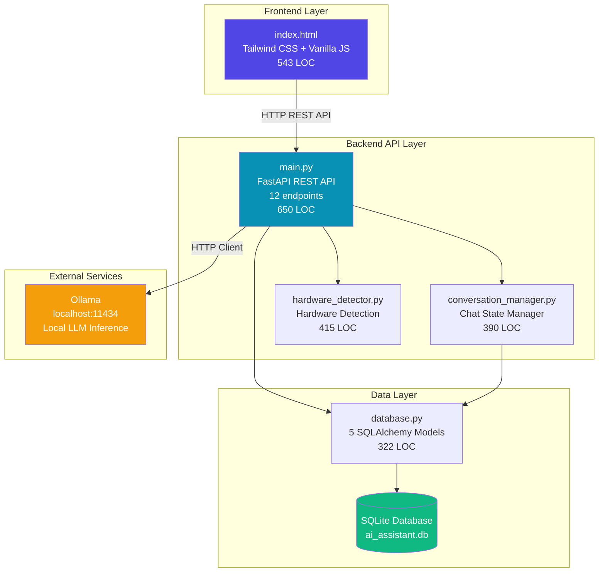
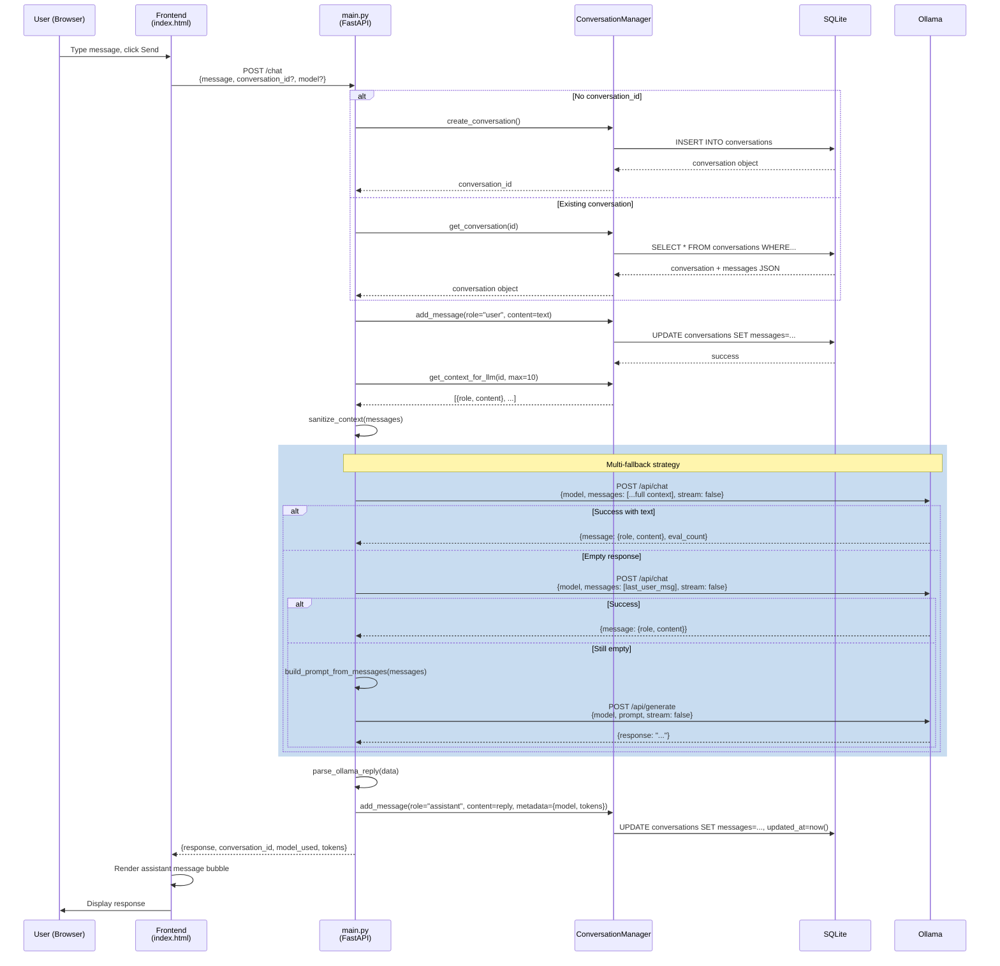
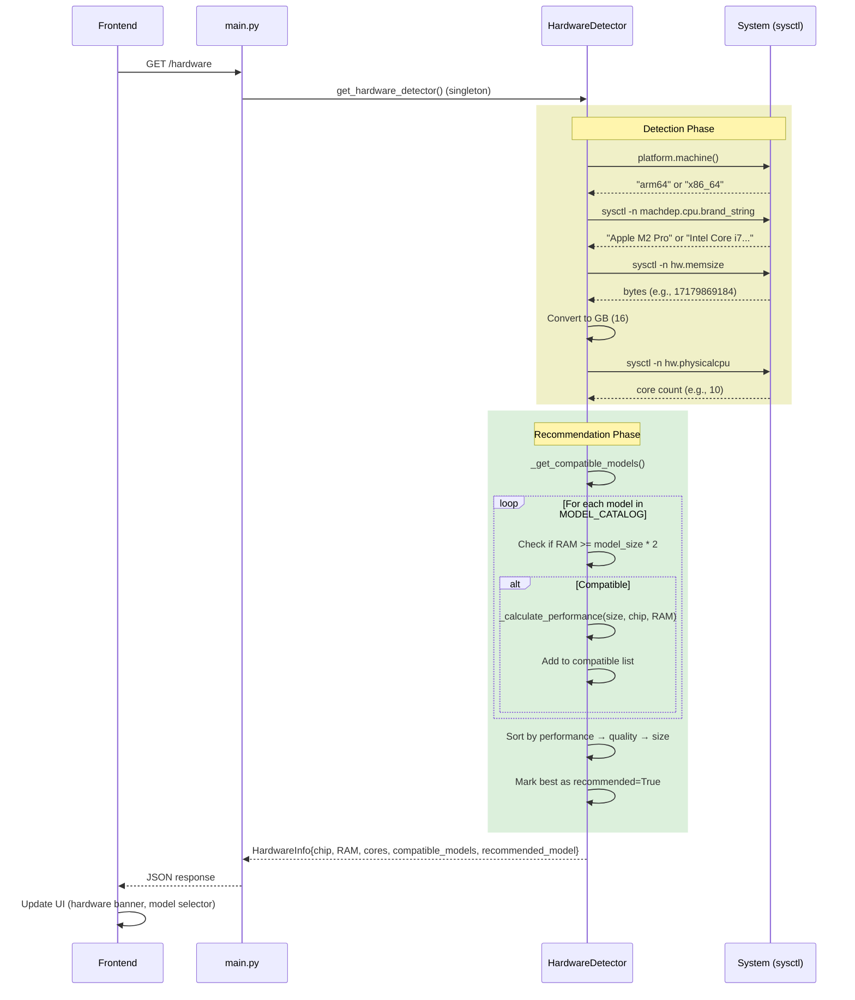
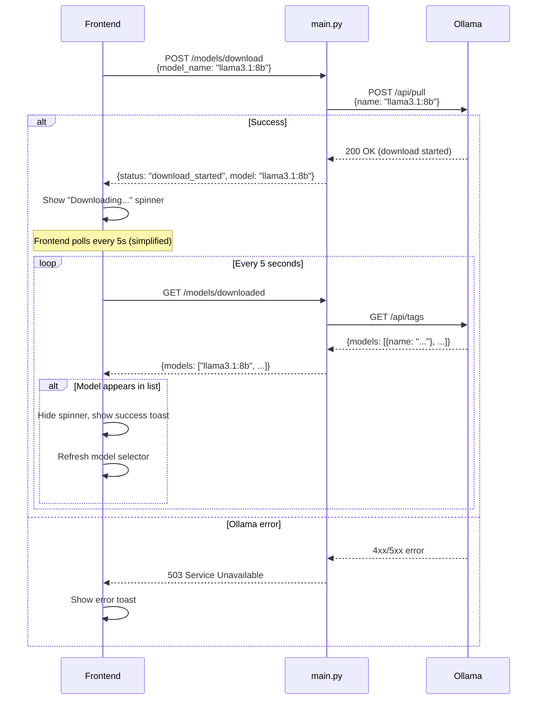
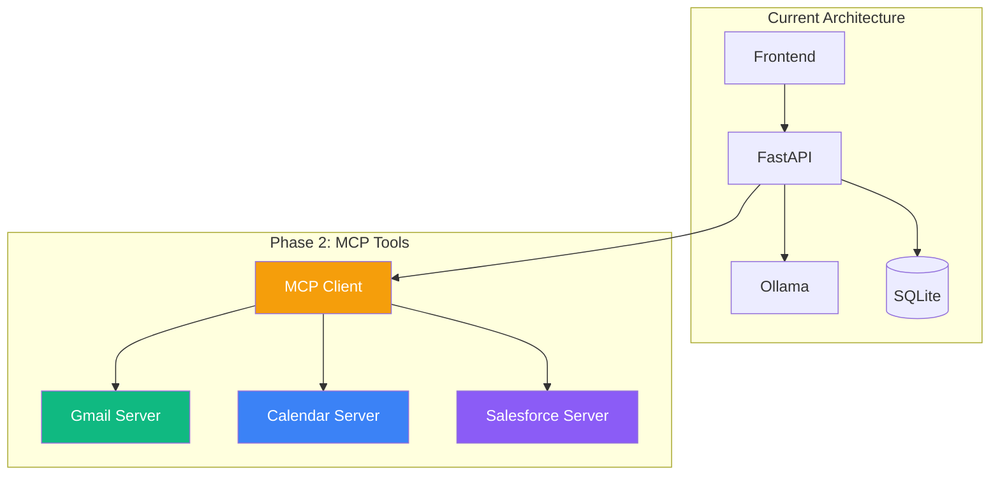
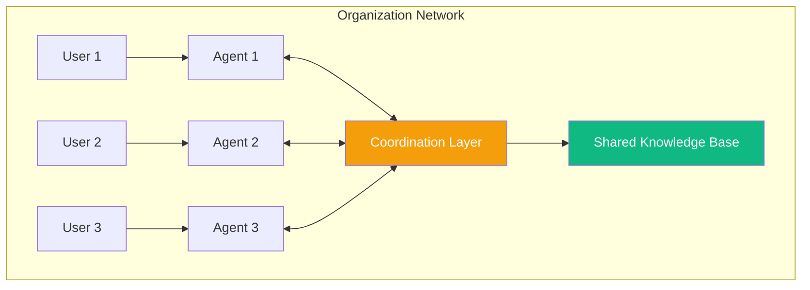

# Architecture Documentation

## Overview

AI Assistant is a local-first chat application that runs large language models on your Mac hardware via Ollama. The system consists of a FastAPI backend, SQLite database, and single-page HTML frontend, optimized for Mac Apple Silicon and Intel processors.

**Version**: 0.1.0 (MVP)
**Status**: Production-ready for single-user local deployment
**Repository**: https://github.com/turmex/ai-assistant-public

## System Architecture



## Component Breakdown

### Frontend Layer (frontend/index.html)

**Purpose**: Single-page chat interface with real-time model management

**Technology**:
- HTML5 with Tailwind CSS (CDN)
- Vanilla JavaScript (no framework dependencies)
- Async/await for API communication

**Key Features**:
- Hardware information dashboard (chip, RAM, cores, compatible models)
- Model selector with download capability
- Chat interface with message history
- Health status indicator (Online/Degraded/Offline)
- Example prompts sidebar
- Toast notifications
- Auto-scrolling chat container

**State Management**:
- `conversationId`: Current conversation UUID
- `availableModels`: Hardware-compatible models from detection
- `downloadedModels`: Locally available Ollama models
- `selectedModel`: Currently selected model metadata

**API Communication**:
- Base URL: `http://localhost:8000`
- Timeout: 20s default, 120s for chat/download
- Error handling: Graceful degradation with user notifications

**File Reference**: frontend/index.html:1-543

### Backend API Layer

#### main.py (FastAPI Application)

**Purpose**: REST API server orchestrating chat, model management, and hardware detection

**Architecture Pattern**: ASGI async application with lifespan management

**Lifespan Events** (main.py:46-97):
- **Startup**:
  1. Initialize SQLite database (create tables)
  2. Detect hardware specs (singleton HardwareDetector)
  3. Check Ollama availability (non-fatal)
  4. Log system status
- **Shutdown**: Graceful cleanup

**CORS Configuration**: Permissive for MVP (allow all origins) - restrict in production

**Key Design Decisions**:
1. **Multi-fallback chat strategy** (main.py:486-512):
   - Try `/api/chat` with full conversation context
   - Fallback: `/api/chat` with last user message only
   - Final fallback: `/api/generate` with flattened prompt
   - Prevents empty responses from context issues

2. **Context sanitization** (main.py:201-232):
   - Ensures valid `{role, content}` structure for Ollama
   - Handles mixed content types (text, arrays, objects)
   - Filters invalid messages

3. **Hardware-aware defaults** (main.py:175-178):
   - Uses HardwareDetector singleton for model recommendations
   - Fallback to `llama3.1` if detection fails

**Error Handling**:
- HTTPException for user-facing errors (404, 503)
- Logging with context (conversation ID, model used)
- Breadcrumb logging for empty response debugging

**File Reference**: backend/main.py:1-650

#### conversation_manager.py

**Purpose**: Conversation state management and database abstraction

**Design Pattern**: Repository pattern - abstracts database operations

**Core Responsibilities**:
1. **Conversation CRUD**:
   - Create new conversations (UUID generation)
   - Retrieve by ID
   - Delete conversations
   - List user conversations with pagination

2. **Message Management**:
   - Add user/assistant messages
   - Store metadata (model, tokens, timestamp)
   - JSON message storage in Conversation.messages column

3. **LLM Context Formatting** (conversation_manager.py:200-234):
   - Extract last N messages
   - Format as `[{role, content}, ...]`
   - Strip metadata for token efficiency

4. **Intent Detection (MVP Placeholder)** (conversation_manager.py:236-309):
   - Keyword-based detection for demo
   - Returns: `{intent_type, tools_needed, confidence}`
   - **Future**: Replace with LLM-based intent classification for MCP tools

**Database Interaction**:
- Uses SQLAlchemy ORM with explicit commits
- `flag_modified()` for JSON column updates
- Rollback on errors

**File Reference**: backend/conversation_manager.py:1-390

#### hardware_detector.py

**Purpose**: Mac hardware detection and model recommendation engine

**Detection Capabilities**:
- **CPU Architecture**: Apple Silicon vs Intel (via `platform.machine()`)
- **Chip Model**: M1/M2/M3 Pro/Max/Ultra (via `sysctl`)
- **RAM**: Total system memory in GB (via `sysctl hw.memsize`)
- **CPU Cores**: Physical core count (via `sysctl hw.physicalcpu`)

**Model Catalog** (hardware_detector.py:44-101):
8 pre-configured models with metadata:
- llama3.2:1b (1.3GB) - fastest, basic quality
- llama3.2:3b (2.0GB) - fast, good quality
- phi3:mini (2.3GB) - fast, good for code
- mistral:7b (4.1GB) - fast, high quality
- llama3.1:8b (4.7GB) - balanced, high quality ⭐
- gemma2:9b (5.5GB) - slower, high quality
- llama3.2:11b (6.5GB) - slower, excellent quality
- codellama:13b (7.4GB) - slow, excellent for code

**Recommendation Algorithm** (hardware_detector.py:315-386):
1. Filter models by RAM requirement (2x model size)
2. Calculate performance score:
   - RAM headroom = total RAM - (model size × 2)
   - Apple Silicon: 2-3x faster than Intel for same model
   - Performance tiers: excellent → good → acceptable → slow
3. Sort by: performance → quality → size (ascending)
4. Mark best-fit model as "recommended"

**Performance Estimates**:
- **Apple Silicon**:
  - Excellent: 10-15 tok/s (headroom ≥8GB, model ≤5GB)
  - Good: 5-10 tok/s (headroom ≥4GB, model ≤7GB)
  - Acceptable: 2-5 tok/s (headroom ≥0GB)
- **Intel**:
  - Good: 5-10 tok/s (headroom ≥16GB, model ≤4GB)
  - Acceptable: 3-5 tok/s (headroom ≥8GB, model ≤5GB)
  - Slow: 1-3 tok/s (headroom ≥0GB)

**Singleton Pattern** (hardware_detector.py:409-414):
```python
_detector_instance = None
def get_hardware_detector() -> HardwareDetector:
    global _detector_instance
    if _detector_instance is None:
        _detector_instance = HardwareDetector()
    return _detector_instance
```

**Fallback Strategy**: Returns safe default (llama3.2:3b) on detection failure

**File Reference**: backend/hardware_detector.py:1-415

### Data Layer

#### database.py (SQLAlchemy Models)

**Purpose**: Database schema, ORM models, session management

**Database Engine**: SQLite with `check_same_thread=False` for FastAPI async

**Settings Management** (database.py:34-64):
- Pydantic BaseSettings for environment configuration
- Loads from `.env` file
- Validates types automatically

**Data Models**:

##### 1. User (database.py:79-101)
```python
id: int (PK)
email: str (unique, indexed)
created_at: datetime
# Relationships: tool_connections, workflows, conversations
```
**Purpose**: Multi-user support (MVP uses default user "default@local")

##### 2. ToolConnection (database.py:104-141)
```python
id: int (PK)
user_id: int (FK → users.id)
service_name: str (gmail/calendar/salesforce)
display_name: str
is_connected: bool
auth_data: Text (encrypted OAuth tokens)
last_connected: datetime
created_at, updated_at: datetime
# Index: (user_id, service_name)
```
**Purpose**: Store OAuth credentials for MCP tool integration (future)

##### 3. Workflow (database.py:144-186)
```python
id: int (PK)
user_id: int (FK)
name: str
description: Text
trigger: JSON  # {type: "schedule/manual/event", config: {...}}
actions: JSON  # [{tool: "gmail", action: "send", params: {...}}, ...]
is_active: bool
use_local_llm: bool
created_at, updated_at, last_run: datetime
# Relationships: executions
# Index: (user_id, is_active)
```
**Purpose**: Workflow automation definitions (future)

##### 4. WorkflowExecution (database.py:189-229)
```python
id: int (PK)
workflow_id: int (FK)
status: str  # pending/running/success/failed
started_at, completed_at: datetime
actions_executed: JSON
results: JSON
error_message: Text
model_used: str
tokens_used: int
# Index: (workflow_id, status), started_at
```
**Purpose**: Execution history and debugging logs (future)

##### 5. Conversation (database.py:232-264)
```python
id: int (PK)
user_id: int (FK)
conversation_id: str (unique UUID, indexed)
messages: JSON  # [{role, content, timestamp, metadata}, ...]
created_at, updated_at: datetime
# Index: user_id, updated_at
```
**Purpose**: Chat history storage (currently active in MVP)

**Session Management** (database.py:282-298):
```python
def get_db() -> Generator[Session, None, None]:
    db = SessionLocal()
    try:
        yield db
    finally:
        db.close()
```
**Usage**: FastAPI dependency injection via `Depends(get_db)`

**Helper Functions**:
- `init_db()`: Create all tables (database.py:267-279)
- `get_or_create_user()`: Get/create default user for MVP (database.py:301-321)

**File Reference**: backend/database.py:1-322

## Data Flow Diagrams

### Chat Message Flow



### Hardware Detection Flow



### Model Download Flow



## Design Patterns & Principles

### 1. Singleton Pattern

**Usage**: HardwareDetector (hardware_detector.py:409-414)

**Rationale**: Hardware detection is expensive (subprocess calls) and immutable during runtime. Cache results globally.

```python
_detector_instance: Optional[HardwareDetector] = None

def get_hardware_detector() -> HardwareDetector:
    global _detector_instance
    if _detector_instance is None:
        _detector_instance = HardwareDetector()
    return _detector_instance
```

### 2. Factory Pattern

**Usage**: ConversationManager creation (conversation_manager.py:379-389)

**Rationale**: Decouple manager instantiation from database session lifecycle.

```python
def get_conversation_manager(db: Session) -> ConversationManager:
    return ConversationManager(db)
```

### 3. Dependency Injection

**Usage**: FastAPI route handlers (main.py:451, 550, 566, etc.)

**Rationale**: Automatic database session management with cleanup.

```python
@app.post("/chat")
async def chat(request: ChatRequest, db: Session = Depends(get_db)):
    # db automatically provided and cleaned up
    conv_manager = get_conversation_manager(db)
    ...
```

### 4. Repository Pattern

**Usage**: ConversationManager (conversation_manager.py:23-377)

**Rationale**: Abstract database operations, enable testing, centralize query logic.

```python
class ConversationManager:
    def __init__(self, db: Session):
        self.db = db

    def create_conversation(self) -> Conversation:
        # Encapsulates DB logic
        ...

    def get_conversation_history(self, id: str) -> List[Dict]:
        # Abstracts retrieval
        ...
```

### 5. Multi-Fallback Strategy

**Usage**: Chat endpoint (main.py:486-512)

**Rationale**: Ollama's `/api/chat` endpoint can fail with complex context. Graceful degradation ensures users always get a response.

```python
try:
    # Strategy 1: Full context
    text, raw = await ollama_chat(client, model, ctx_full)
except:
    try:
        # Strategy 2: Last message only
        text, raw = await ollama_chat(client, model, [last_user])
    except:
        # Strategy 3: Flattened prompt
        prompt = build_prompt_from_messages(ctx_full)
        text, raw = await ollama_generate(client, model, prompt)
```

## Security Considerations

### Current State (MVP)

- **No Authentication**: Single-user local app, no login required
- **No Authorization**: All endpoints publicly accessible on localhost
- **CORS**: Wide open (`allow_origins=["*"]`) for development
- **Secrets**: OAuth credentials in `.env` (unused in MVP)
- **Data Encryption**: None (SQLite unencrypted, local filesystem)

### Future Production Hardening

1. **Authentication**:
   - Implement OAuth 2.0 for user login
   - Store sessions in database or Redis
   - JWT tokens for API authentication

2. **Authorization**:
   - Row-level security (users can only access their conversations)
   - Tool connection ownership validation

3. **CORS**:
   - Restrict to specific frontend origin(s)
   - Remove wildcard origins

4. **Secrets Management**:
   - Encrypt OAuth tokens with `cryptography` library
   - Use `SECRET_KEY` from environment for encryption
   - Store encrypted data in `ToolConnection.auth_data`

5. **Input Validation**:
   - Rate limiting (even for local use, prevent abuse)
   - Context size limits (prevent Ollama overload)
   - Message content sanitization (XSS prevention)

6. **Database**:
   - Use SQLCipher for encrypted SQLite
   - Regular backups
   - Prepared statements (already using via SQLAlchemy)

## Scalability & Performance

### Current Limitations

- **Single-user**: No multi-tenancy
- **SQLite**: Not suitable for concurrent multi-user access
- **Local LLM**: Inference speed depends on hardware
- **No caching**: Every request hits Ollama (no response cache)
- **No load balancing**: Single Ollama instance

### Future Scaling Strategy

1. **Database**: Migrate to PostgreSQL for multi-user deployment
2. **Caching**: Redis for conversation context, model metadata
3. **LLM Routing**:
   - Route simple queries to fast local models
   - Route complex queries to cloud LLMs (Claude/GPT)
4. **Horizontal Scaling**: Multiple FastAPI workers with shared DB
5. **Message Queue**: Celery for background tasks (workflow execution)

## Error Handling Strategy

### Categories

1. **User Errors** (4xx):
   - 404: Conversation not found
   - 400: Invalid request payload
   - Response: JSON `{detail: "Human-readable message"}`

2. **Service Errors** (5xx):
   - 503: Ollama unavailable
   - 500: Internal server error (unexpected exceptions)
   - Response: JSON `{detail: "Error message"}`

3. **Ollama Errors**:
   - Connection refused: Check Ollama running
   - Empty response: Multi-fallback strategy
   - Model not found: Suggest download

### Logging

Current: Basic `logging.info()` and `logging.error()`

**Improvement Needed** (see docs/INFRASTRUCTURE.md):
- Structured logging (JSON)
- Request ID tracking
- Performance metrics (latency, token throughput)
- Error aggregation

## Testing Strategy

See: TESTING_GUIDE.md (project root)

**Current Testing**:
- Manual verification via verify.sh
- Frontend: Browser testing
- Backend: Manual API testing

**Recommended**:
- Unit tests: pytest for business logic
- Integration tests: Database operations
- E2E tests: Playwright for frontend flows
- Load tests: Locust for API endpoints

## Deployment Architecture

### Development

```
Developer Machine (Mac)
├── Terminal 1: cd backend && uvicorn main:app --reload (port 8000)
├── Terminal 2: Ollama running (port 11434)
└── Browser: open frontend/index.html (file:// or localhost:8080)
```

### Production (Local Installation)

```
User's Mac
├── systemd/launchd: Auto-start backend on boot
├── Ollama: System service
├── Frontend: Served by FastAPI static files or nginx
└── Database: ~/Library/Application Support/ai-assistant/ai_assistant.db
```

## Key Constraints & Trade-offs

### Constraints

1. **Mac-only**: Hardware detection uses macOS-specific `sysctl` commands
2. **Local inference**: Requires powerful Mac (8GB+ RAM for decent models)
3. **SQLite**: Single-writer bottleneck (not an issue for single-user)
4. **No streaming**: MVP uses synchronous responses (no WebSocket/SSE)

### Trade-offs

| Decision | Pro | Con |
|----------|-----|-----|
| SQLite vs PostgreSQL | Simple setup, no server | Limited concurrency |
| JSON messages column | Flexible schema | Hard to query individual messages |
| Hardcoded model catalog | Fast startup | Manual updates needed |
| Single-page frontend | No build step | Harder to organize as it grows |
| No auth in MVP | Faster development | Security gap for multi-user |
| Vanilla JS | No dependencies | More boilerplate vs React/Vue |

## Future Architecture Evolution

### Phase 2: MCP Tool Integration



**Changes Needed**:
1. Implement `ToolConnection` OAuth flow
2. Spawn MCP server processes
3. Intent detection → tool routing logic
4. Tool response integration into chat

### Phase 3: Multi-Agent Collaboration



**Changes Needed**:
1. Multi-user authentication
2. Agent-to-agent communication protocol
3. Shared conversation context
4. Permission/access control

## Related Documentation

- **AI_QUICK_REF.md**: Ultra-concise reference (~480 tokens)
- **API.md**: Complete endpoint specifications
- **DEPENDENCIES.md**: Dependency graph and rationale
- **INFRASTRUCTURE.md**: Logging, monitoring, error handling
- **ROADMAP.md**: Feature timeline
- **DECISIONS.md**: Architecture Decision Records
- **CODE_STANDARDS.md**: Coding conventions
- **DEVELOPMENT.md**: Setup and contributing guide
