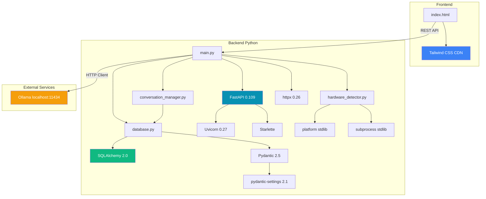

# Dependencies

Comprehensive dependency map and rationale for all project dependencies.

## Dependency Graph



## Backend Dependencies (requirements.txt)

### Core Framework

#### FastAPI 0.109.0
**Purpose**: Modern async web framework for building REST APIs

**Why chosen**:
- Automatic OpenAPI/Swagger documentation
- Pydantic integration for request/response validation
- Async/await support out of the box
- Type hints for better IDE support
- Dependency injection system
- Fast performance (comparable to Node.js/Go)

**Used in**:
- main.py: All route handlers, dependency injection (`Depends(get_db)`)
- Request/response models (`ChatRequest`, `HealthResponse`)

**Alternatives considered**:
- **Flask**: More mature but lacks async support, manual OpenAPI docs
- **Django**: Too heavy for this use case, includes ORM we don't need flexibility for
- **Litestar**: Similar to FastAPI but less ecosystem support

#### Uvicorn 0.27.0 [standard]
**Purpose**: Lightning-fast ASGI server for FastAPI

**Why chosen**:
- Official recommendation from FastAPI
- `[standard]` includes uvloop and httptools for best performance
- Auto-reload in development mode
- Signal handling (graceful shutdown)

**Used in**:
- main.py:642-649: Entry point `uvicorn.run()`
- Development: `uvicorn main:app --reload`

**Alternatives considered**:
- **Hypercorn**: Trio/asyncio support but slower
- **Gunicorn + Uvicorn workers**: For production multi-worker setup (future)

### Data Validation & Settings

#### Pydantic 2.5.3
**Purpose**: Data validation and serialization using type hints

**Why chosen**:
- Automatic validation of request/response data
- Type coercion (e.g., string → int)
- Custom validators
- JSON schema generation
- 5-50x faster than Pydantic v1 (Rust core)

**Used in**:
- main.py:123-161: Request/response models
- database.py: SQLAlchemy model validation

**Key models**:
- `ChatRequest`, `ChatResponse`
- `HealthResponse`
- `ModelInfo`, `ModelsResponse`
- `ModelDownloadRequest`

#### pydantic-settings 2.1.0
**Purpose**: Load settings from environment variables

**Why chosen**:
- Type-safe environment config
- Automatic `.env` file loading
- Validation of required vs optional settings
- Separated from main Pydantic since v2.0

**Used in**:
- database.py:34-64: `Settings` class loads from `.env`

**Config loaded**:
```python
OLLAMA_BASE_URL, DEFAULT_LOCAL_MODEL
DATABASE_URL
HOST, PORT, DEBUG
GOOGLE_CLIENT_ID, GOOGLE_CLIENT_SECRET (future OAuth)
```

### Database

#### SQLAlchemy 2.0.25
**Purpose**: SQL toolkit and ORM (Object-Relational Mapping)

**Why chosen**:
- Industry standard Python ORM
- 2.0: Modern async support, improved type hints
- Declarative models (easy to read/write)
- Relationship management
- Works with SQLite (MVP) and PostgreSQL (future)
- Migration support via Alembic

**Used in**:
- database.py: All 5 models (User, ToolConnection, Workflow, WorkflowExecution, Conversation)
- Session management: `SessionLocal`, `get_db()`
- Relationships: `user.conversations`, `workflow.executions`

**Key features used**:
- `declarative_base()`: Base class for models
- `Column`, `ForeignKey`, `relationship()`
- `JSON` column type for flexible data
- `Index` for query optimization
- `create_engine()`, `sessionmaker()`

**Alternatives considered**:
- **Django ORM**: Tied to Django framework
- **Peewee**: Simpler but less powerful, smaller community
- **Raw SQL**: Too verbose, prone to SQL injection

#### Alembic 1.13.1
**Purpose**: Database migration tool (SQLAlchemy companion)

**Why chosen**:
- Official SQLAlchemy migration tool
- Auto-generates migration scripts from model changes
- Version control for database schema
- Rollback support

**Status**: Installed but not configured in MVP

**Future setup**:
```bash
alembic init migrations
alembic revision --autogenerate -m "Initial schema"
alembic upgrade head
```

**Used for**: Schema versioning when migrating SQLite → PostgreSQL

### HTTP Client

#### httpx 0.26.0
**Purpose**: Async HTTP client for calling Ollama API

**Why chosen**:
- Async/await support (unlike `requests`)
- Connection pooling
- Timeout control
- HTTP/2 support
- Similar API to `requests` (easy to learn)
- Better error handling

**Used in**:
- main.py:166-173: Health checks to Ollama
- main.py:247-261: Chat and generate calls
- main.py:358-376: Model listing and downloading

**Ollama endpoints called**:
```python
GET  /api/tags       # List models
POST /api/chat       # Chat with context
POST /api/generate   # Simple completion
POST /api/pull       # Download model
```

**Alternatives considered**:
- **aiohttp**: More complex API, less intuitive
- **requests**: Sync only (blocks async loop)

### Utilities

#### python-dotenv 1.0.0
**Purpose**: Load environment variables from `.env` file

**Why chosen**:
- Simple and reliable
- Standard for Python projects
- Prevents committing secrets to git

**Used in**:
- database.py: Pydantic Settings loads via `env_file=".env"`

**Example `.env`**:
```bash
OLLAMA_BASE_URL=http://localhost:11434
DATABASE_URL=sqlite:///./ai_assistant.db
```

#### python-multipart 0.0.6
**Purpose**: Parse multipart/form-data requests

**Why chosen**:
- Required by FastAPI for file uploads
- Lightweight dependency

**Status**: Installed for future file upload features (workflows, attachments)

**Future use**: Upload workflow configs, conversation exports

#### schedule 1.2.0
**Purpose**: Job scheduling (cron-like)

**Why chosen**:
- Simple Pythonic API
- Ideal for periodic tasks
- No external dependencies (pure Python)

**Status**: Installed for future workflow scheduling

**Future use**:
```python
import schedule

schedule.every().day.at("09:00").do(run_daily_workflow)
schedule.every().hour.do(sync_calendar)
```

**Alternatives considered**:
- **APScheduler**: More powerful but complex
- **Celery**: Full task queue (overkill for local app)

#### cryptography 41.0.7
**Purpose**: Encrypt OAuth tokens in database

**Why chosen**:
- Industry-standard crypto library
- High-level recipes (Fernet encryption)
- Actively maintained

**Status**: Installed but unused in MVP

**Future use**:
```python
from cryptography.fernet import Fernet

cipher = Fernet(settings.SECRET_KEY)
encrypted_token = cipher.encrypt(oauth_token.encode())
# Store in ToolConnection.auth_data
```

**Use case**: Encrypt Google/Salesforce OAuth tokens before storing

## Frontend Dependencies

### Tailwind CSS 3.x (CDN)
**Purpose**: Utility-first CSS framework

**Why chosen (over custom CSS)**:
- Rapid prototyping without writing CSS
- Consistent design system (colors, spacing, typography)
- Responsive utilities built-in
- JIT compiler (only includes used classes)
- Production-ready components

**Used in**:
- frontend/index.html: All styling via utility classes
- Dark theme: `bg-slate-900`, `text-slate-100`
- Animations: `animate-typing`, `animate-spin`

**CDN used**:
```html
<script src="https://cdn.tailwindcss.com"></script>
```

**Alternatives considered**:
- **Bootstrap**: Component-heavy, opinionated design
- **Custom CSS**: More control but slower development
- **Tailwind CLI**: Requires build step (avoiding for simplicity)

**Production optimization**: Switch to compiled CSS for smaller bundle

---

## External Service Dependencies

### Ollama (localhost:11434)
**Purpose**: Local LLM inference engine

**Why chosen**:
- Runs models locally (privacy, no API costs)
- Simple REST API
- Active development
- Wide model support (Llama, Mistral, Gemma, etc.)
- Mac-optimized (Metal GPU acceleration)

**Requirements**:
- macOS 11.0+ (Big Sur)
- 8GB+ RAM (16GB+ recommended)
- Internet (for model downloads only)

**Used in**:
- main.py:84-93: Health checks
- main.py:247-261: Chat inference
- main.py:379-392: Model downloads

**Alternatives considered**:
- **LM Studio**: GUI-focused, less scriptable
- **llama.cpp**: Lower-level, requires more setup
- **LocalAI**: More complex, Docker-based

### SQLite (Embedded)
**Purpose**: Embedded SQL database

**Why chosen (for MVP)**:
- Zero configuration (no server to run)
- Single file database
- ACID compliant
- Fast for single-user scenarios
- Ships with Python (no install needed)

**Used in**:
- database.py: Storage for all models
- Default location: `backend/ai_assistant.db`

**Limitations**:
- Single writer (not an issue for local single-user)
- Limited concurrency
- No built-in replication

**Future migration**: PostgreSQL for multi-user deployment

---

## Standard Library Dependencies

### platform
**Purpose**: Detect OS and architecture

**Used in**:
- hardware_detector.py:203-213: Detect Apple Silicon vs Intel
- `platform.machine()`: Returns `"arm64"` or `"x86_64"`

### subprocess
**Purpose**: Run system commands (sysctl)

**Used in**:
- hardware_detector.py:218-270: Detect chip model, RAM, CPU cores
- Commands: `sysctl -n machdep.cpu.brand_string`, `sysctl -n hw.memsize`

**Security note**: All commands use hardcoded strings (no user input)

### logging
**Purpose**: Application logging

**Used in**: All backend modules for debugging and monitoring

**Current setup**: Basic `logging.basicConfig()`

**Future improvements** (see INFRASTRUCTURE.md):
- Structured logging (JSON)
- Log rotation
- Centralized logging (Elasticsearch, CloudWatch)

### typing
**Purpose**: Type hints for better IDE support and validation

**Used extensively** for type safety:
- `Optional[T]`, `List[T]`, `Dict[K, V]`
- `Tuple`, `Any`, `Generator`

### datetime
**Purpose**: Timestamp management

**Used in**:
- database.py: `created_at`, `updated_at` columns
- conversation_manager.py: Message timestamps

**Note**: Using `datetime.utcnow()` for consistency (all times in UTC)

---

## Dependency Security

### Vulnerability Scanning

**Recommended tools**:
```bash
# Check for known vulnerabilities
pip-audit

# Update dependencies
pip install --upgrade -r requirements.txt

# Check outdated packages
pip list --outdated
```

### Pinning Strategy

**Current**: Exact versions pinned (`fastapi==0.109.0`)

**Rationale**:
- Reproducible builds
- Prevents breaking changes
- Easier debugging

**Trade-off**: Manual updates needed for security patches

**Future**: Use `poetry` or `pipenv` for better dependency management

---

## Dependency Size Analysis

| Package | Size | Purpose |
|---------|------|---------|
| SQLAlchemy | 5.8 MB | ORM, essential |
| FastAPI | 4.2 MB | Framework, essential |
| httpx | 2.1 MB | HTTP client, essential |
| Pydantic | 8.7 MB | Validation, essential |
| Uvicorn | 1.5 MB | Server, essential |
| cryptography | 12.3 MB | OAuth encryption, **future** |
| Alembic | 2.9 MB | Migrations, **future** |
| schedule | 0.1 MB | Workflows, **future** |

**Total**: ~37 MB (backend Python packages)

**Frontend**: ~0 bytes (CDN-loaded Tailwind)

---

## Adding New Dependencies

### Process

1. **Evaluate need**: Is it solving a real problem?
2. **Check alternatives**: Is there a stdlib solution?
3. **Review**:
   - Active maintenance (last commit <6 months)
   - License compatibility (MIT, Apache, BSD)
   - Security track record
   - Community size (GitHub stars, PyPI downloads)
4. **Add to requirements.txt** with exact version
5. **Document in this file** with rationale
6. **Test thoroughly** before committing

### Examples

**Good reasons**:
- Redis for caching (performance need)
- pytest for testing (quality need)
- Sentry for error tracking (monitoring need)

**Bad reasons**:
- Using library for 1 function (just write it)
- "Everyone uses it" (cargo cult)
- Adds 50MB for minor feature

---

## Future Dependencies (Phase 2+)

### Planned

| Package | Purpose | Phase |
|---------|---------|-------|
| **mcp** | Model Context Protocol client | Phase 2 |
| **google-auth** | Gmail OAuth | Phase 2 |
| **salesforce-python** | Salesforce API | Phase 2 |
| **redis** | Caching layer | Phase 3 |
| **pytest** | Unit testing | Phase 1 (infrastructure) |
| **pytest-asyncio** | Async test support | Phase 1 |
| **black** | Code formatting | Phase 1 |
| **ruff** | Linting | Phase 1 |
| **mypy** | Type checking | Phase 1 |

### Not Planned (Avoiding)

- **Celery**: Too complex for local app (use `schedule` instead)
- **Django**: Not needed (have FastAPI)
- **Pandas**: No data analysis use case
- **NumPy**: Not doing numerical computing
- **TensorFlow/PyTorch**: Using Ollama for inference

---

## Dependency Update Policy

**Frequency**: Monthly security check, quarterly feature updates

**Process**:
1. Check for security advisories: `pip-audit`
2. Review changelogs for breaking changes
3. Update in development branch
4. Run full test suite
5. Update this documentation
6. Deploy to production

**Breaking changes**: Document in CHANGELOG.md with migration guide

---

## Related Documentation

- **ARCHITECTURE.md**: How dependencies are integrated into system
- **DEVELOPMENT.md**: Installing and managing dependencies
- **INFRASTRUCTURE.md**: Logging and monitoring dependencies
- **CODE_STANDARDS.md**: Import ordering and organization
